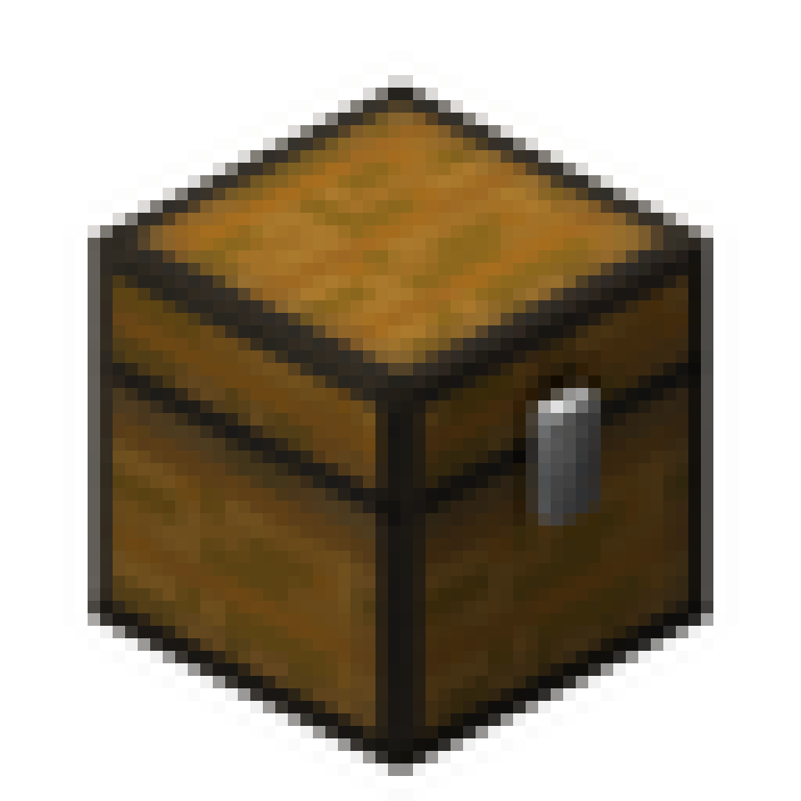

  

  <h1>Auto Storager v1.6.0</h1>

 
 

## **介绍**

配合 Baritone 自动挖矿模组使用的辅助工具。此模组能够实现全物品存储与拿取，模组控制一个游戏账号进行存放和拿取（也可以是自己玩家本身）

 
 

## **教程**

  

点击上方封面图观看演示视频

 
 

## **命令**

- `/autostorager help` - 打开帮助菜单；
- `/autostorager on | off` - 设开启/关闭自动存储；
- `/autostorager name <玩家ID> <玩家ID> ...` - 添加信任者名单(仅名单中的玩家才能操控机器人)；
- `/autostorager reply <回复模式>` - 设置回复方式(chat/no/w/tell/msg)；
- `/autostorager classify <on 、off>` - 开启/关闭分类模式；
- `/autostorager sel1 | sel2 <X> <Y> <Z>` - 设置储存区域选点(如果不输入XYZ则使用当前坐标作为设置)；
- `/autostorager clear` - 重置数据(清除设置的sel1和sel2，清除仓库中记录的物品，不会清除信任名单)；

 

- PS：玩家可以使用悄悄话发送指令，如：/w <机器人ID> 存放。
- `存放` - 存放物品到仓库矩阵；
- `拿取 <物品名称 | 物品ID> <数量> ...` - 从仓库矩阵中拿取物品(名为“拿取”箱子满了，会把物品放回仓库矩阵)；
- `拿取 潜影盒 <物品名称 | 物品ID> <数量> ...` - 拿取存有指定物品的潜影盒(记录为潜影盒最前面的物品)；
- `拿取 全部` - 把仓库矩阵中的物品全部取出；
- `检查` - 检查仓库矩阵中的所有箱子"；
- `网页` - 生成一个网页链接查看仓库物品数量。

 
 

## **版本更新**

- **v1.0 版本**：
  - 模组开关指令功能；
  - 玩家ID白名单功能；
  - 两点坐标设置仓库区域指令；
  - 清除坐标及物品记录指令；
  - 聊天栏`存放` `拿取 <物品ID> <数量>` `拿取 全部` `检查`指令。
- **v1.5.1 版本**：
  - 修复部分BUG；
  - 新增`/autostorager reply`设置机器人回复模式；
  - 新增`/autostorager classify`物品分类开关；
  - `拿取 <物品名称> <数量> ...`支持物品名称，不在限制于物品英文ID；
  - `拿取 <物品ID> <数量> <物品ID> <数量> ...`支持多物品同时拿取；
  - 新增`拿取潜影盒`可拿取放有指定物品的潜影盒；
  - 新增`网页`可生成一个查看仓库物品数量的网页。
- **v1.6.0 版本**：
  - 网页增加更多功能。

 
 
 
 

# 反馈与支持
如果你在使用过程中遇到问题、需要帮助或有任何建议，欢迎通过以下渠道联系我们。你的反馈可能将推动Auto Storager改进！

## 加入交流群
- **QQ群**：欢迎加入我们的QQ交流群，与开发者和其他用户直接交流。
  - 群号：`1067558374`
  - 或点击链接快速加入：[点击加入QQ群](https://qm.qq.com/q/RcnG8PGgcS)
  - 扫码加入：

  

 
 

## 赞助支持
如果这个项目对您有帮助，欢迎赞助支持项目的持续开发和维护。
- **爱发电**：[点击支持](https://afdian.com/a/AutoSail)
- **微信赞助**：

  

     
    <small>微信赞助</small>
  

 
 

## 其他反馈方式
- **电子邮件**：发送邮件至 `3145372042@qq.com`

 
 

**感谢你的使用与支持！**

---
